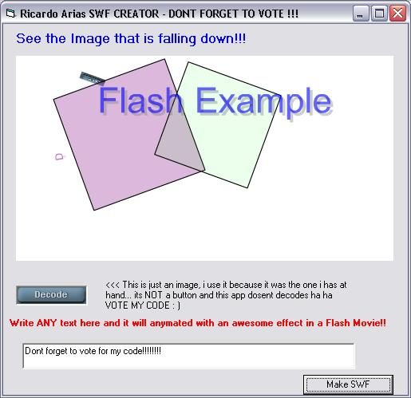



## awesome FLASH MOVIE maker with great effects\!\!\!

### Description

This awesome code will let you make your own FLASH MOVIES from your VB project, with great effects (text, image, etc) just as Macromedia applications!!!

This beautty its not finished yet, but it does a lot of things now.

At the moment this handle great text animations/effects, image animations and effects, transparencies, etc.

The zip contains everything you need to run the code, basically code!!

Im sure this is one of the best codes in PSC. DONT FORGET TO VOTE.

I promise to continue developing it if you vote and give feedback.

Thanks to Matthew for the idea!!
 
### More Info
 

             |
---                |---
**Submitted On**   |2001-07-20 07:09:58
**By**             |[ricardo arias](https://github.com/Planet-Source-Code/PSCIndex/blob/master/ByAuthor/ricardo-arias.md)
**Level**          |Intermediate
**User Rating**    |4.8 (134 globes from 28 users)
**Compatibility**  |VB 6\.0
**Category**       |[Graphics](https://github.com/Planet-Source-Code/PSCIndex/blob/master/ByCategory/graphics__1-46.md)
**World**          |[Visual Basic](https://github.com/Planet-Source-Code/PSCIndex/blob/master/ByWorld/visual-basic.md)
**Archive File**   |[awesome\_FL1531951202003\.zip](https://github.com/Planet-Source-Code/ricardo-arias-awesome-flash-movie-maker-with-great-effects__1-42583/archive/master.zip)

